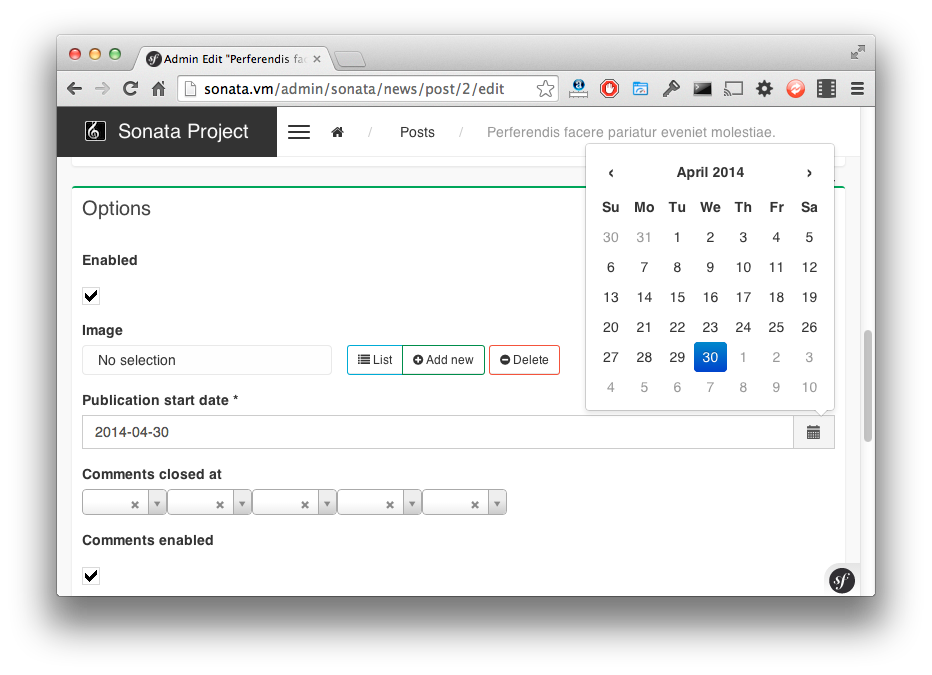

.. index::
    double: Form Type; Definition

Form Types
==========

The bundle comes with some handy form types.

DoctrineORMSerializationType
^^^^^^^^^^^^^^^^^^^^^^^^^^^^

This form type reads ``JMSSerializer`` serialization class metadata and uses ``Doctrine`` ORM entity metadata to generate form fields and correct types.

All you have to do is to define a form type service for each entity for which you want to use a form type, like this:

.. code-block:: xml

    <service id="my.custom.form.type.post" class="Sonata\CoreBundle\Form\Type\DoctrineORMSerializationType">
        <tag name="form.type" alias="my_custom_form_type_comment" />

        <argument type="service" id="jms_serializer.metadata_factory" />
        <argument type="service" id="doctrine" />
        <argument>my_custom_form_type_comment</argument>
        <argument>My\CustomBundle\Entity\Comment</argument>
        <argument>a_serialization_group</argument>
    </service>

The service definition should contain the following arguments:

* The JMSSerializer metadata factory,
* The Doctrine ORM entity manager,
* The form type name,
* The entity class name for which you want to build form,
* The serialization group you want serialization fields have.

sonata_type_immutable_array
^^^^^^^^^^^^^^^^^^^^^^^^^^^

The ``Immutable Array`` allows you to edit an array property by defining a type per key.

The type has a ``keys`` parameter which contains the definition for each key.
A definition is an array with 3 options:

* key name,
* type: a type name or a ``FormType`` instance,
* related type parameters: please refer to the related form documentation.

Let's say a ``Page`` has options property with some fixed key-value pairs.
Each value has a different type: `integer`, `url`, or `string` for instance.

.. code-block:: php

    <?php
    class Page
    {
        protected $options = array(
            'ttl'       => 1,
            'redirect'  => ''
        );

        public function setOptions(array $options)
        {
            $this->options = $options;
        }

        public function getOptions()
        {
            return $this->options;
        }
    }

Now, the property can be edited by setting a type for each type:

.. code-block:: php

        <?php
        $form->add('options', 'sonata_type_immutable_array', array(
            'keys' => array(
                array('ttl',        'text', array('required' => false)),
                array('redirect',   'url',  array('required' => true)),
            )
        ));

sonata_type_boolean
^^^^^^^^^^^^^^^^^^^

The ``boolean`` type is a specialized ``ChoiceType``, where the list of choices is locked to *no* and *no*.

Note that for backward compatibility reasons, it will set your value to *1* for *yes* and to *2* for *no*.
If you want to map to a boolean value, just set the option ``transform`` to true. For instance, you need to do so when mapping to a doctrine boolean.

sonata_type_translatable_choice
^^^^^^^^^^^^^^^^^^^^^^^^^^^^^^^

.. warning::

    ``sonata_type_translatable_choice`` is deprecated,  use ``ChoiceType`` with the ``translation_domain`` option instead!

The translatable type is a specialized ``ChoiceType`` where the choices values are translated with the Symfony Translator component.

The type has one extra parameter:

 * ``catalogue``: the catalogue name to translate the value.

.. code-block:: php

    <?php

    // The delivery list
    class Delivery
    {
        public static function getStatusList()
        {
            return array(
                self::STATUS_OPEN      => 'status_open',
                self::STATUS_PENDING   => 'status_pending',
                self::STATUS_VALIDATED => 'status_validated',
                self::STATUS_CANCELLED => 'status_cancelled',
                self::STATUS_ERROR     => 'status_error',
                self::STATUS_STOPPED   => 'status_stopped',
            );
        }
    }

    // form usage
    $form->add('deliveryStatus', 'sonata_type_translatable_choice', array(
        'choices' => Delivery::getStatusList(),
        'catalogue' => 'SonataOrderBundle'
    ))

.. note::

    For more information, you can check the official `ChoiceType documentation <http://symfony.com/doc/current/reference/forms/types/choice.html>`_.

StatusType
^^^^^^^^^^

The ``StatusType`` is not available as a service. However, you can use it to declare your own type to render a choice of status.

Let's say, you have a ``Delivery::getStatusList`` method which returns a list of status. Now, you want to create a form type to expose those values.

.. code-block:: php

    <?php
    // The delivery list
    class Delivery
    {
        public static function getStatusList()
        {
            return array(
                self::STATUS_OPEN      => 'status_open',
                self::STATUS_PENDING   => 'status_pending',
                self::STATUS_VALIDATED => 'status_validated',
                self::STATUS_CANCELLED => 'status_cancelled',
                self::STATUS_ERROR     => 'status_error',
                self::STATUS_STOPPED   => 'status_stopped',
            );
        }
    }

This can be done by declaring a new service:

.. configuration-block::

    .. code-block:: xml

        <service id="sonata.order.form.status_type" class="Sonata\CoreBundle\Form\Type\StatusType">
            <argument>%sonata.order.order.class%</argument>
            <argument>getStatusList</argument>
            <argument>sonata_order_status</argument>

            <tag name="form.type" alias="sonata_order_status" />
        </service>

And the type can now be used:

.. code-block:: php

    <?php
    $form->add('deliveryStatus', 'sonata_order_status')

sonata_type_date_picker and sonata_type_datetime_picker
^^^^^^^^^^^^^^^^^^^^^^^^^^^^^^^^^^^^^^^^^^^^^^^^^^^^^^^

Those types integrate `Eonasdan's Bootstrap datetimepicker <https://github.com/Eonasdan/bootstrap-datetimepicke>`_ into a Symfony2 form. They both are available as services, and inherit from ``date`` and ``datetime`` default form types.

.. note::

    These form types require you to have bootstrap and jquery assets available in your project.

They will allow you to have a JS date picker onto your form fields as follows:

In order to use them, you'll need to perform a bit of setup:

.. code-block:: yaml

    # app/config.yml
    twig:
        # ...
        form:
            resources:
                # ...
                - 'SonataCoreBundle:Form:datepicker.html.twig'

In your layout, you'll need to add the assets dependencies (feel free to adapt this to your needs, for instance to use with assetic):

.. code-block:: html

    <head>
        <!-- ... -->
        
        
        
        
        <link rel="stylesheet" href="path_to_bootstrap.min.css" />
        <link rel="stylesheet" href="/bundles/sonatacore/public/vendor/eonasdan-bootstrap-datetimepicker/build/css/bootstrap-datetimepicker.min.css" />
    </head>

Finally, in your form, you may use the form type as follows:

.. code-block:: php

    <?php

    // ...
        $builder
            ->add('publicationDateStart', 'sonata_type_datetime_picker')    // Or sonata_type_date_picker if you don't need the time
            // ...
        ;

