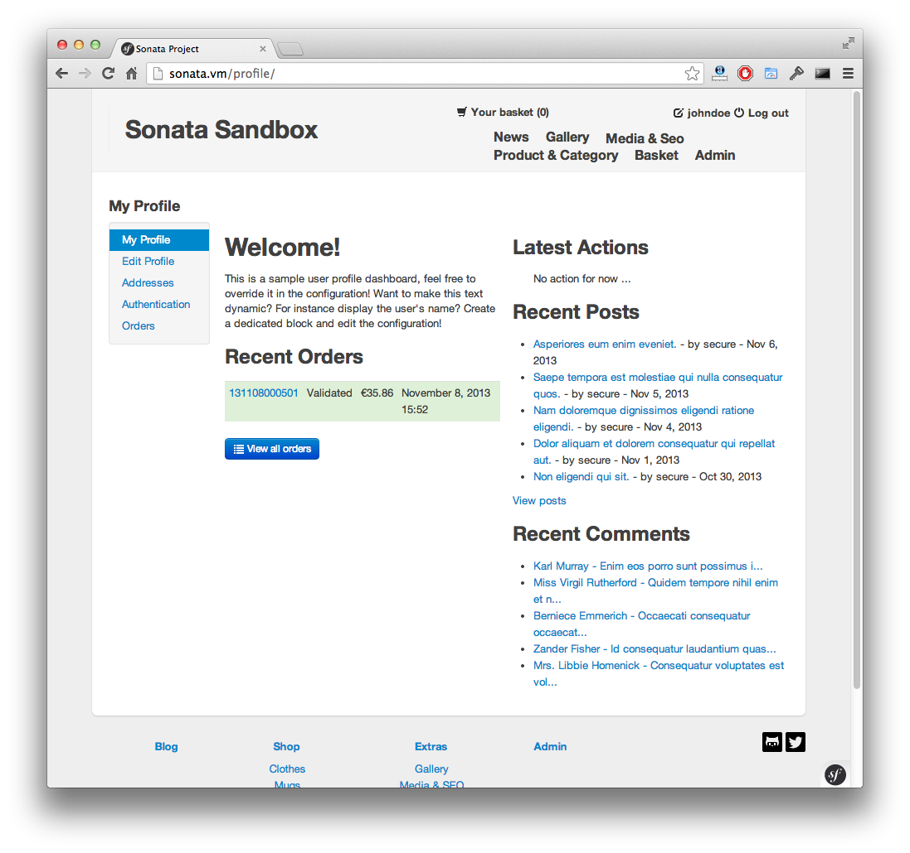

.. index::
    single: Dashboard

User Dashboard
==============

``SonataUserBundle`` provides an easy way to customize the user portal (reachable through the /profile URL).

Here's a preview:

Configuration
-------------

The default menu offers profile edition & user password forms.

Would you like to customize this menu ? you can do so in the `sonata_user` configuration:

.. code-block:: yaml

    sonata_user:
        profile:
            # Profile show page is a dashboard as in SonataAdminBundle
            dashboard:
                blocks:
                    - { position: left, type: sonata.block.service.text, settings: { content: "<h2>Welcome!</h2> This is a sample user profile dashboard, feel free to override it in the configuration! Want to make this text dynamic? For instance display the user's name? Create a dedicated block and edit the configuration!"} }
                    - { position: left, type: sonata.order.block.recent_orders, settings: { title: Recent Orders, number: 5, mode: public }}
                    - { position: right, type: sonata.timeline.block.timeline, settings: { max_per_page: 15 }}
                    - { position: right, type: sonata.news.block.recent_posts, settings: { title: Recent Posts, number: 5, mode: public }}
                    - { position: right, type: sonata.news.block.recent_comments, settings: { title: Recent Comments, number: 5, mode: public }}
            # Customize user portal menu by setting links
            menu:
                - { route: 'sonata_user_profile_show', label: 'sonata_profile_title', domain: 'SonataUserBundle'}
                - { route: 'sonata_user_profile_edit', label: 'link_edit_profile', domain: 'SonataUserBundle'}
                - { route: 'sonata_customer_addresses', label: 'link_list_addresses', domain: 'SonataCustomerBundle'}
                - { route: 'sonata_user_profile_edit_authentication', label: 'link_edit_authentication', domain: 'SonataUserBundle'}
                - { route: 'sonata_order_index', label: 'order_list', domain: 'SonataOrderBundle'}

If you want to display the menu in your action's template, you should inherit the ``SonataUserBundle:Profile:action.html.twig`` template. There you can override the ``sonata_profile_title`` & ``sonata_profile_content`` blocks.

Dashboard
---------

The ``Profile:show`` page is a dashboard as in SonataAdminBundle (you may see the documentation `here <https://sonata-project.org/bundles/admin/master/doc/reference/dashboard.html>`_). You may specify the blocks you want there, their settings and their positions. By default a simple text is displayed, but it's up to you to put there whatever you want.

In the sample configuration you may see above, we chose to put this text, plus the latest orders from the customer attached to the customer, the latest user's actions, latest posts & comments on the website.

Block
-----

You also have the ability to customize the block responsible for displaying the menu with the following options:

* ``menu_name``
    This takes a Knp menu name as the argument and will completely override the menu.

* ``menu_class``
    The menu ``<ul>`` class(es); by default set to ``nav nav-list``.

* ``current_class``
    The current ``<li>`` element class(es); by default set to ``active``.

* ``first_class and last_class``
    The first and last ``<li>`` element class(es) in the menu ; by default empty.

Menu Factory
------------

The `ProfileMenuBuilder` class is responsible for creating the user menu. It offers two public methods:

* ``createProfileMenu`` which generates a new ``ItemInterface`` instance
* ``buildProfileMenu`` which configures an existing ``ItemInterface`` instance.

The latter method throws an event once configured: ``sonata.user.profile.configure_menu`` of type ``ProfileMenuEvent`` which contains the configured ``ItemInterface`` instance, would you choose to override it.

